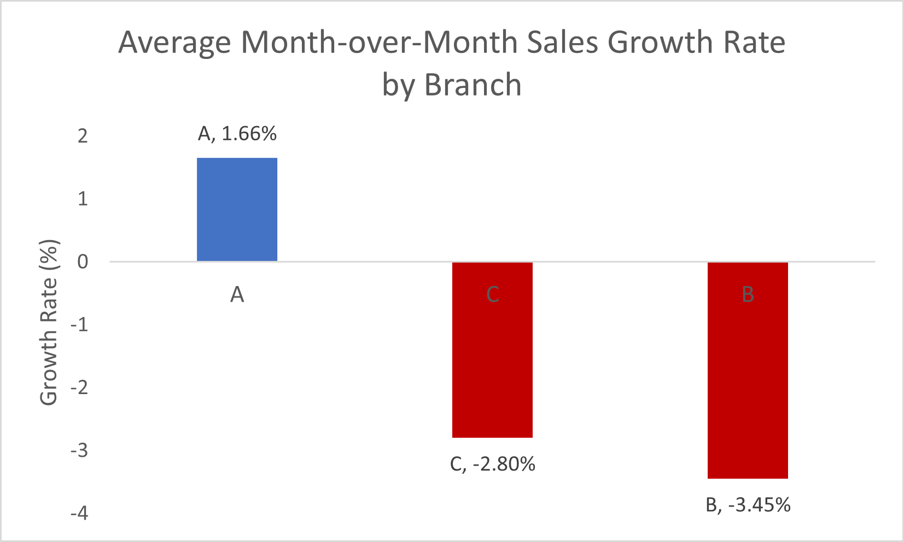
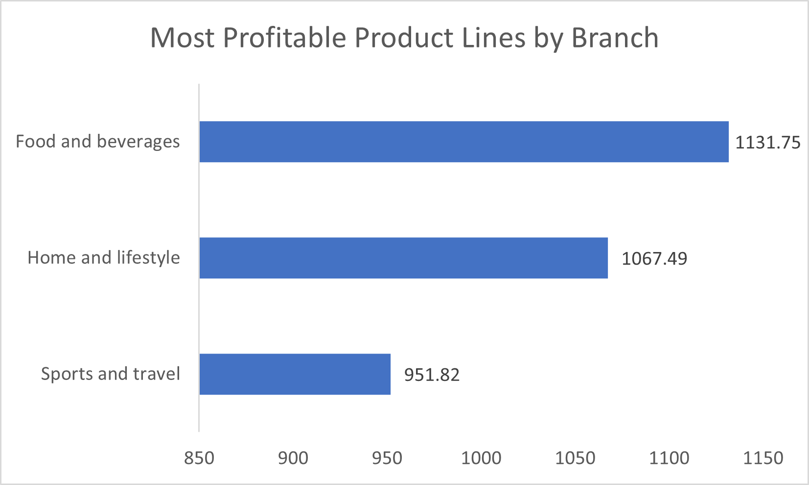
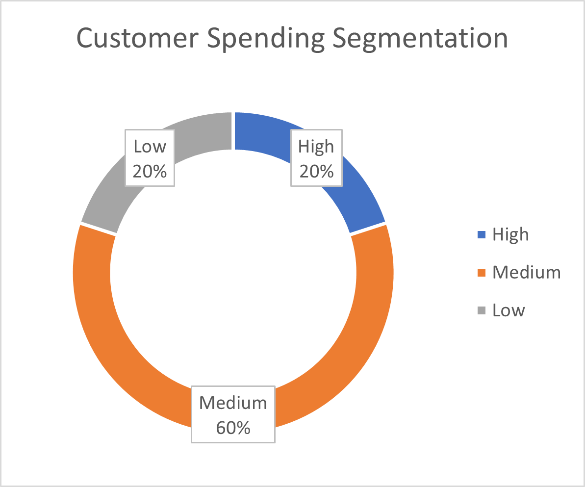
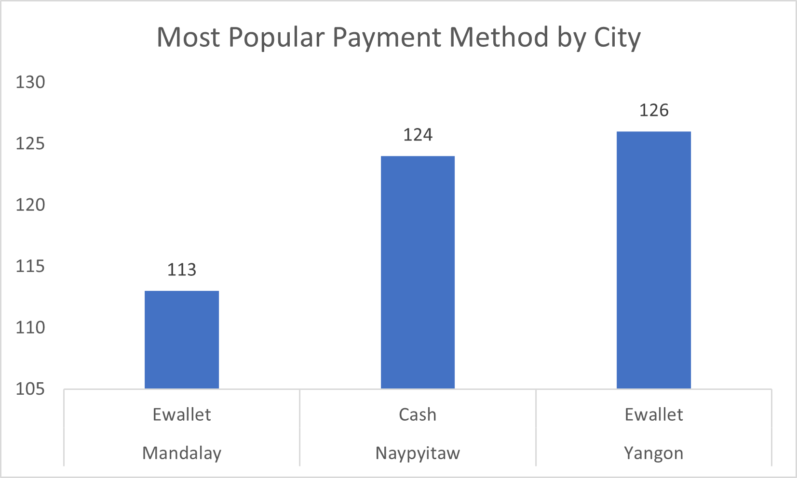
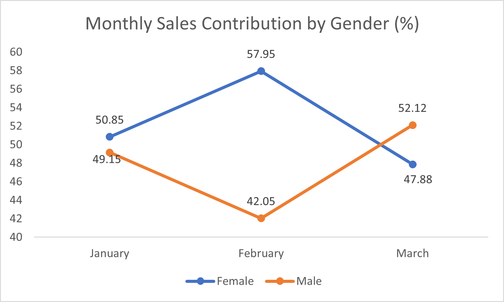
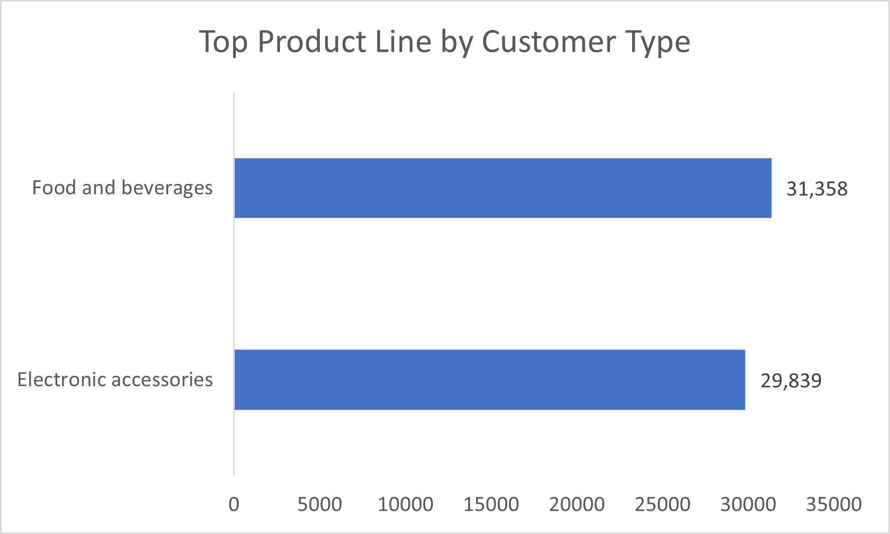
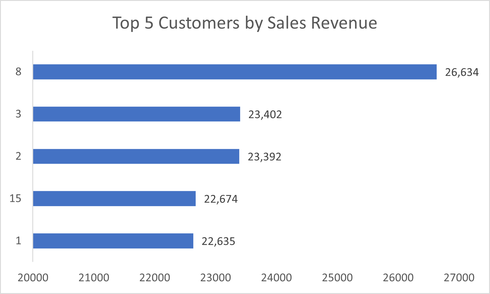
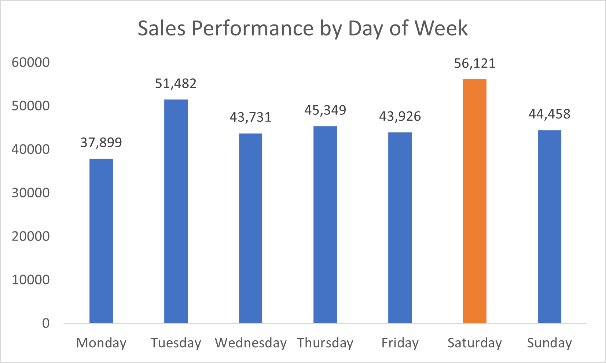

# Walmart Sales Performance Analysis Using MySQL

## Project Overview

This project analyzes Walmart sales transaction data using MySQL to uncover business insights, sales trends, customer behavior, and product performance. The analysis demonstrates how SQL can be used to transform raw transactional data into actionable business intelligence for data-driven decision-making.

---

## Business Objectives

- Analyze overall sales performance
- Identify top-performing branches
- Evaluate product line profitability
- Understand customer purchasing behavior
- Discover revenue trends and patterns
- Generate actionable business recommendations

---

## Dataset Information

**Source:** Walmart Sales Dataset

The dataset contains transactional sales records including:

- Invoice ID
- Branch
- City
- Customer Type
- Gender
- Product Line
- Unit Price
- Quantity
- Tax
- Total Revenue
- Date
- Time
- Payment Method
- Customer Rating

---

## SQL Concepts Applied

This project demonstrates practical use of:

- SELECT Statements
- WHERE Clauses
- GROUP BY
- ORDER BY
- Aggregate Functions
- CASE Statements
- Subqueries
- Common Table Expressions (CTEs)
- Window Functions
- Business KPI Calculations
- Data Exploration & Analysis

---

## Business Questions Solved

1. Which branch generated the highest revenue?
2. Which product line contributed the most sales?
3. What are the monthly sales trends?
4. Which customer segment is most profitable?
5. Which payment methods are most preferred?
6. Which cities contribute the highest revenue?
7. How do customer ratings vary across branches?
8. Which gender contributes the most revenue?
9. Who are the top customers by spending?
10. What are the peak sales periods?

---

## Project Structure

```text
Walmart-Sales-Performance-Analysis-MySQL
│
├── Dataset
│   └── walmart_sales_dataset.csv
│
├── SQL_Scripts
│   └── walmart_sales_analysis.sql
│
├── Presentation
│   └── walmart_sales_analysis_presentation.pptx
│
├── Images
│   ├── task1_growth.png
│   ├── task2_profitability.png
│   ├── task3_segmentation.png
│   ├── task5_payment_method.png
│   ├── task6_gender_sales.png
│   ├── task7_product_line.png
│   ├── task9_top_customers.png
│   └── task10_sales_trend.png
│
└── README.md
```

---

## Project Visualizations

### Sales Growth Analysis



### Profitability Analysis



### Customer Segmentation



### Payment Method Analysis



### Gender-Based Sales Analysis



### Product Line Performance



### Top Customers Analysis



### Sales Trend Analysis



---

## Key Findings

- Identified the highest-performing branch based on total revenue.
- Determined the most profitable product categories.
- Analyzed customer purchasing behavior across different segments.
- Evaluated payment preferences among customers.
- Measured sales contribution by gender and customer type.
- Discovered key sales trends and growth patterns.
- Identified top customers contributing significantly to revenue.

---

## Tools & Technologies

- MySQL
- SQL
- GitHub
- Microsoft PowerPoint
- Data Analytics Techniques

---

## Skills Demonstrated

- SQL Query Writing
- Data Cleaning
- Data Exploration
- Business Analysis
- KPI Development
- Data Storytelling
- Data Visualization
- Problem Solving
- Reporting & Presentation

---

## Business Impact

This project demonstrates how SQL can be leveraged to transform raw retail transaction data into meaningful business insights. The findings can support decision-making related to sales strategy, customer engagement, product performance optimization, and revenue growth.

---

## Author

### Botta Lokesh

Aspiring Data Analyst | SQL | Power BI | Python | Data Analytics

🔗 LinkedIn: https://www.linkedin.com/in/botta-lokesh

🔗 GitHub: https://github.com/botta-lokesh

---

### If you found this project useful, consider giving it a ⭐ on GitHub.
